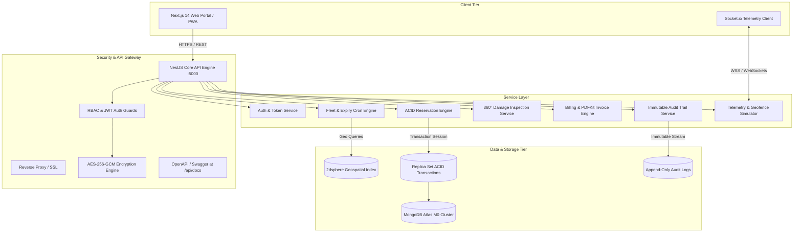
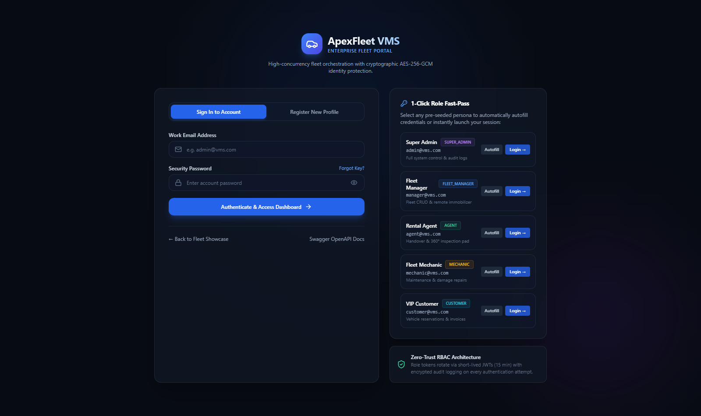
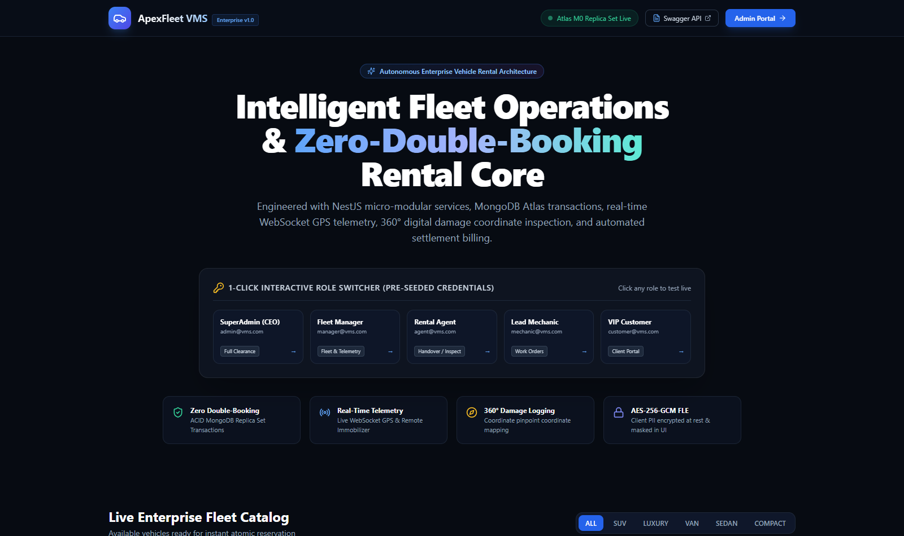
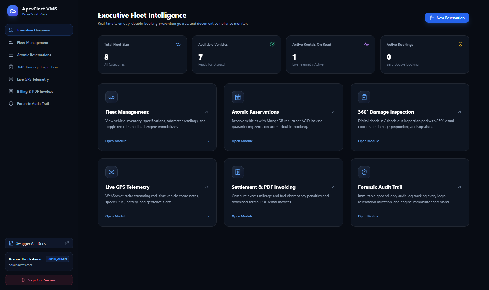
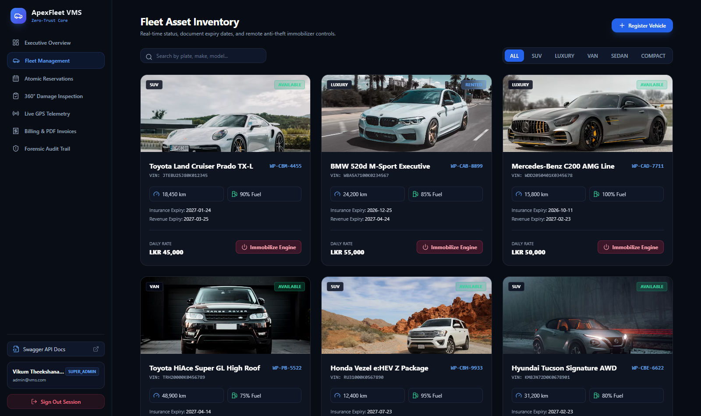
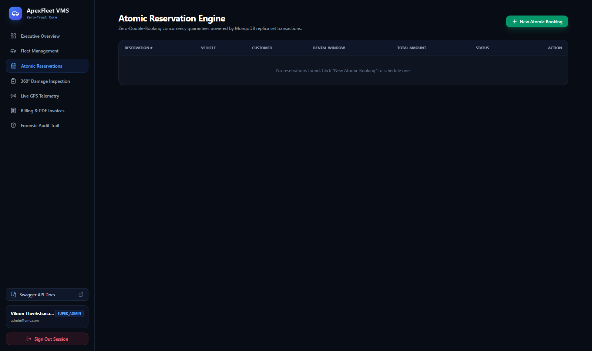
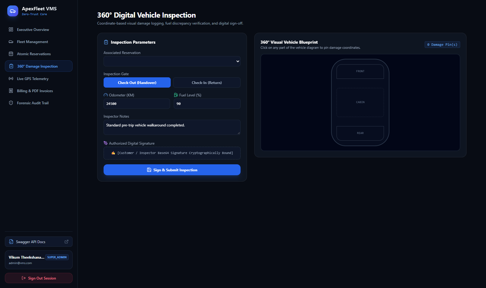
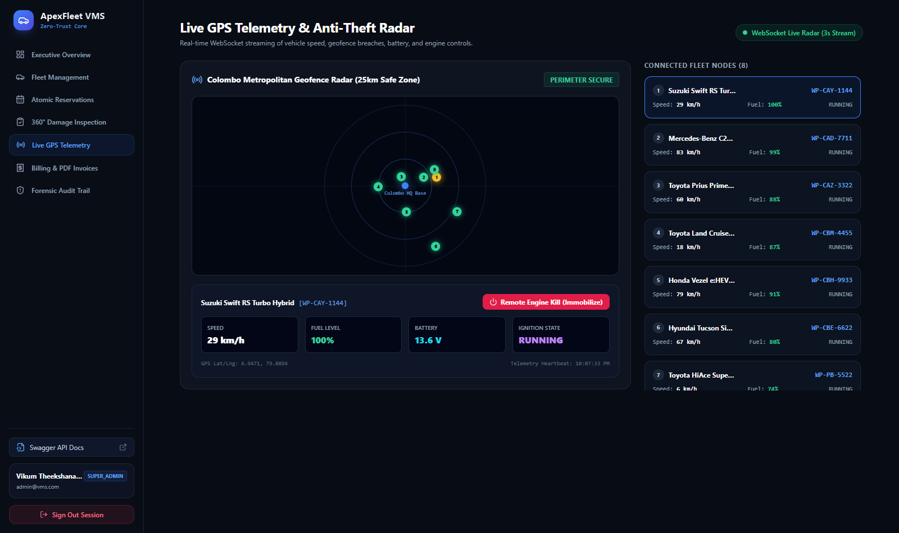
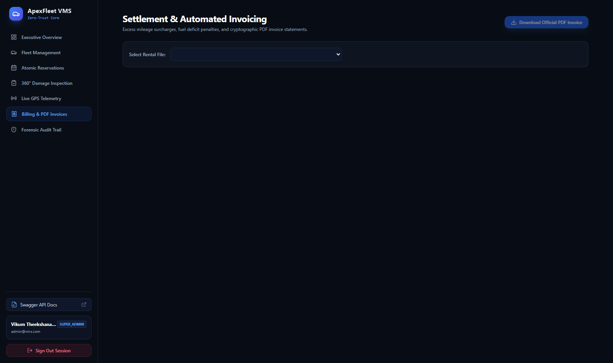
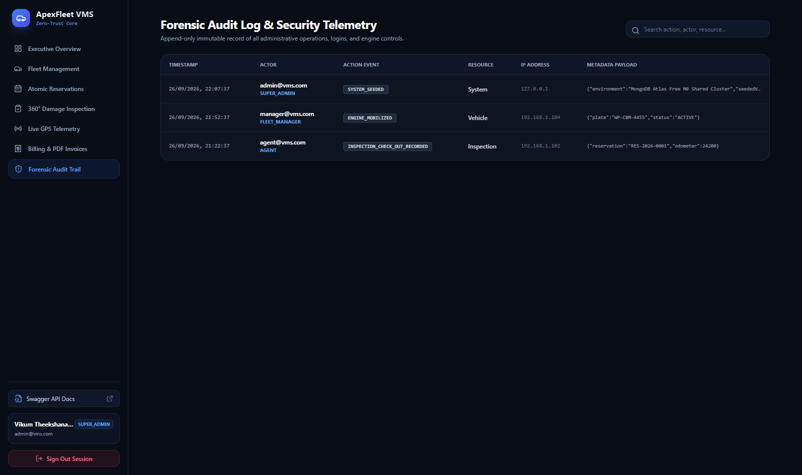

<div align="center">

# 🚗 Enterprise Vehicle Rental & Fleet Management System (VMS)
### Autonomous, High-Concurrency, DevSecOps-Grade Fleet Orchestration Platform


[](https://nestjs.com/)
[-000000?style=for-the-badge&logo=nextdotjs&logoColor=white)](https://nextjs.org/)
[-47A248?style=for-the-badge&logo=mongodb&logoColor=white)](https://www.mongodb.com/atlas)
[](https://www.typescriptlang.org/)
[](https://tailwindcss.com/)
[](https://socket.io/)
[](https://nodejs.org/api/crypto.html)
[](LICENSE)

<br/>

**A production-ready, highly secure Vehicle Rental & Fleet Management System engineered for enterprise fleet operators, commercial car rentals, and luxury vehicle networks.**

[Explore Live Demo](#-getting-started--live-execution) • [Architecture Diagrams](#-system-architecture) • [Module Highlights](#-enterprise-modules--engineering-highlights) • [API Swagger Docs](#-api-endpoints--swagger-openapi) • [Author](#-author)

---

</div>

## 📌 Executive Overview

The **Enterprise Vehicle Rental & Fleet Management System (VMS)** is designed from the ground up to eliminate common vulnerabilities in fleet rental platforms—such as race-condition double bookings, unbilled vehicle damage, fuel/mileage discrepancies, and untracked telemetry anomalies.

Operating on a **MongoDB Atlas Replica Set** running full multi-document ACID transactions, this platform guarantees absolute reservation isolation, cryptographic privacy for driver identity records using **AES-256-GCM**, live GPS telematics with anti-theft remote engine immobilizers, 360° interactive damage pinpointing, and instant settlement PDF invoice generation.

---

## 🏗️ System Architecture



---

## 🌟 Enterprise Modules & Engineering Highlights

### 1. 🛡️ Cryptographic Security & RBAC Subsystem
- **AES-256-GCM Encryption**: Highly sensitive Personally Identifiable Information (Driver's License, National Identity Card / NIC, and Phone Numbers) are encrypted with hardware-accelerated AES-256-GCM before writing to the database.
- **Dual JWT Lifecycle**: 15-minute cryptographically signed Access Tokens paired with secure Refresh Tokens and automated rotation.
- **Granular RBAC**: 5 distinct operational roles (`SUPER_ADMIN`, `FLEET_MANAGER`, `AGENT`, `MECHANIC`, `CUSTOMER`) enforced via custom decorators and NestJS execution context reflection.
- **DevSecOps Defenses**: Helmet HTTP headers, strict CORS whitelisting, rate-limiting, and parameter pollution prevention.

### 2. ⚡ Atomic Reservation Engine (Zero Double-Booking Guarantee)
- Prevents race conditions during high-concurrency booking spikes via **MongoDB Multi-Document ACID Transactions**.
- Queries all active and confirmed overlapping reservations within `[pickupDate, returnDate]` before executing vehicle reservation locks.
- Dynamic rate calculations considering base daily rates, deposit hold amounts, seasonal multipliers, and real-time availability states.

### 3. 🚗 Fleet Orchestration & Document Expiry Engine
- Complete asset lifecycle tracking across Luxury, Electric, Sedan, and SUV classes with VIN, license plate, odometer, fuel/battery capacity, and maintenance schedules.
- **Automated Expiry Alerts**: Background cron evaluation identifies insurance policies, revenue licenses, and road fitness certificates expiring within 30 days.
- **Remote Anti-Theft Engine Immobilizer**: Toggle vehicle ignition lockdown state on the fly with live status synchronization.

### 4. 📋 Digital Handover & 360° Damage Inspection Pad
- Check-in and check-out verification workflows recording exact odometer readings and fuel tank levels.
- **360° Visual Coordinate Pinpointing**: Mark scratch, dent, glass chip, or mechanical wear damages directly on an interactive vehicle canvas with coordinate mappings (`x`, `y`), severity ratings, and inspector notes.
- Embedded digital signature capture for legal non-repudiation.

### 5. 📡 Real-Time WebSockets GPS Telemetry & Geofence Simulator
- WebSocket gateway streaming live coordinates, speed (km/h), fuel/battery levels, and engine statuses at 3-second intervals.
- Integrated **Geofencing Engine** utilizing GeoJSON `2dsphere` calculations to trigger automated alerts upon perimeter breaches.
- Remote immobilizer kill switch command simulated directly through WebSocket telemetry packets.

### 6. 💳 Settlement, Deposit Releases & PDF Invoicing
- Automated invoice computation calculating baseline rental charges, security deposit hold/refund amounts, excess mileage penalties ($1.50/km), and fuel discrepancy surcharges ($3.00/L).
- Built-in **PDFKit Generation Engine** compiling formal, branded, tamper-evident corporate rental invoices directly streamable to the client.

### 7. 📜 Forensic Append-Only Audit Trail
- High-integrity, immutable audit logger capturing actor IDs, role types, action verbs (`LOGIN`, `RESERVATION_CREATED`, `IMMOBILIZER_ENGAGED`), target resources, and client IP addresses.
- Retained for compliance, fraud prevention, and operational dispute resolution.

---

## 📸 Interface Showcase Gallery

### 1. Secure Authentication & Registration Portal
*Interactive sign-in and registration pad featuring AES-256-GCM encrypted PII fields and 1-click credential fast-pass for testing.*

[](docs/screenshots/00_login_portal.png)

<br/>

### 2. Public Fleet Landing & 1-Click Role Switcher
*Glassmorphic luxury fleet catalog with real-time availability filters, dynamic vehicle specifications, and instant role credentials.*

[](docs/screenshots/01_landing_hero.png)

<br/>

### 3. Executive Fleet Command Center
*Comprehensive KPI analytics, revenue statistics, fleet utilization ratios, active alerts, and immediate sub-system navigation.*

[](docs/screenshots/02_executive_dashboard.png)

<br/>

### 3. Vehicle Inventory & Remote Anti-Theft Control
*Full vehicle asset management displaying mileage, battery/fuel levels, document expiry status, and remote engine immobilizer toggle switches.*

[](docs/screenshots/03_fleet_inventory.png)

<br/>

### 4. Atomic Reservation & Checkout Wizard
*Conflict-free vehicle reservation engine with deposit calculator, customer profile pairing, and MongoDB transaction guard.*

[](docs/screenshots/04_atomic_reservations.png)

<br/>

### 5. 360° Digital Damage Inspection Pad
*Visual handover inspection platform allowing inspectors to pinpoint scratches and dents with exact coordinate mapping and digital signatures.*

[](docs/screenshots/05_damage_inspection_pad.png)

<br/>

### 6. Live GPS Telemetry Radar & Geofence Monitor
*Real-time WebSocket telemetry stream tracking vehicle speeds, battery states, geofence breaches, and remote ignition lockdown controls.*

[](docs/screenshots/06_live_gps_telemetry.png)

<br/>

### 7. Settlement Calculator & PDF Rental Invoices
*Instant financial reconciliation calculating excess mileage penalties and fuel discrepancies with one-click official PDF invoice downloads.*

[](docs/screenshots/07_billing_and_pdf_invoicing.png)

<br/>

### 8. Immutable Forensic Audit Trail
*Append-only tamper-proof security audit log recording every user authentication, vehicle status mutation, and security command.*

[](docs/screenshots/08_immutable_audit_trail.png)

</div>

---

## 🔑 Pre-Configured Test Roles & Credentials

The system comes pre-seeded with 5 comprehensive test accounts covering every security tier:

| Role | Email | Password | Permissions & Scope |
| :--- | :--- | :--- | :--- |
| **Super Admin** | `admin@vms.com` | `Admin@12345` | Global system control, audit logs, immobilizer overrides, user management |
| **Fleet Manager** | `manager@vms.com` | `Manager@12345` | Vehicle CRUD, document maintenance, pricing overrides, telemetry radar |
| **Agent** | `agent@vms.com` | `Agent@12345` | Check-in / check-out inspections, atomic bookings, damage logging |
| **Mechanic** | `mechanic@vms.com` | `Mechanic@12345` | Maintenance logs, odometer updates, damage repair sign-off |
| **Customer** | `customer@vms.com` | `Customer@12345` | Vehicle browsing, reservation history, PDF rental invoice downloads |

---

## 📡 API Endpoints & Swagger OpenAPI

The backend features interactive **Swagger OpenAPI 3.0** documentation accessible live at:
👉 **`http://localhost:5000/api/docs`**

| Method | Endpoint | Description | Access Tier |
| :--- | :--- | :--- | :--- |
| `POST` | `/api/auth/register` | Register new user with encrypted PII | Public |
| `POST` | `/api/auth/login` | Authenticate & receive JWT token pair | Public |
| `GET` | `/api/auth/profile` | Decrypt and retrieve active user profile | Authenticated |
| `GET` | `/api/fleet` | Query vehicles with status and filter flags | Authenticated |
| `POST` | `/api/fleet` | Register new vehicle into the fleet | Fleet Manager / Admin |
| `POST` | `/api/fleet/:id/immobilize` | Toggle remote engine immobilizer state | Fleet Manager / Admin |
| `GET` | `/api/fleet/document-expiries` | Check licenses expiring within N days | Fleet Manager / Admin |
| `POST` | `/api/reservations` | Create reservation with ACID transaction lock | Authenticated |
| `GET` | `/api/reservations` | List active reservations & status | Authenticated |
| `POST` | `/api/inspections` | Record check-in/out with 360° damage coordinates | Agent / Mechanic / Admin |
| `GET` | `/api/inspections/vehicle/:id` | Retrieve damage history for a vehicle | Agent / Mechanic / Admin |
| `GET` | `/api/telemetry/live` | Snapshot of real-time GPS coordinates | Fleet Manager / Admin |
| `POST` | `/api/billing/calculate-settlement` | Compute mileage/fuel penalty breakdown | Agent / Admin |
| `GET` | `/api/billing/:id/invoice-pdf` | Stream official branded PDF invoice | Authenticated |
| `GET` | `/api/audit-logs` | Query append-only immutable audit trail | Super Admin |
| `GET` | `/api/health` | Comprehensive database and memory health check | Public |

---

## 📂 Project Structure

```
VehicleRentManegmentSystem/
├── backend/
│   ├── src/
│   │   ├── config/
│   │   │   └── configuration.ts          # Validated environment configuration
│   │   ├── core/
│   │   │   ├── audit/                    # Append-only immutable audit log service & schema
│   │   │   │   ├── audit.schema.ts
│   │   │   │   └── audit.service.ts
│   │   │   └── encryption/               # AES-256-GCM PII cryptographic service
│   │   │       └── encryption.service.ts
│   │   ├── modules/
│   │   │   ├── auth/                     # JWT authentication, guards & RBAC decorators
│   │   │   │   ├── auth.controller.ts
│   │   │   │   ├── auth.service.ts
│   │   │   │   ├── decorators/roles.decorator.ts
│   │   │   │   ├── guards/
│   │   │   │   └── strategies/jwt.strategy.ts
│   │   │   ├── billing/                  # Penalty calculator & PDFKit invoice generator
│   │   │   │   ├── billing.controller.ts
│   │   │   │   └── billing.service.ts
│   │   │   ├── fleet/                    # Fleet CRUD, immobilizer & expiry alert engine
│   │   │   │   ├── fleet.controller.ts
│   │   │   │   ├── fleet.service.ts
│   │   │   │   └── vehicle.schema.ts
│   │   │   ├── health/                   # System & MongoDB health checks
│   │   │   ├── inspections/              # 360° damage pinpointing & digital signatures
│   │   │   │   ├── inspection.schema.ts
│   │   │   │   ├── inspections.controller.ts
│   │   │   │   └── inspections.service.ts
│   │   │   ├── reservations/             # ACID transaction booking engine
│   │   │   │   ├── reservation.schema.ts
│   │   │   │   ├── reservations.controller.ts
│   │   │   │   └── reservations.service.ts
│   │   │   ├── telemetry/                # WebSocket gateway & mock GPS telemetry generator
│   │   │   │   ├── telemetry.gateway.ts
│   │   │   │   └── telemetry.service.ts
│   │   │   └── users/                    # User schema with encrypted PII hooks
│   │   ├── app.module.ts                 # Master NestJS root module
│   │   ├── main.ts                       # Server bootstrap, Swagger & Helmet integration
│   │   └── seed.ts                       # Database seeder for 5 test roles & fleet
│   ├── tests/
│   │   └── run-all-tests.ts              # End-to-end integration test runner
│   ├── package.json
│   └── tsconfig.json
│
├── frontend/
│   ├── src/
│   │   ├── app/
│   │   │   ├── dashboard/
│   │   │   │   ├── audit/page.tsx        # Forensic audit trail explorer
│   │   │   │   ├── billing/page.tsx      # Settlement & PDF invoice download pad
│   │   │   │   ├── fleet/page.tsx        # Vehicle fleet list & immobilizer controls
│   │   │   │   ├── inspections/page.tsx  # 360° coordinate damage inspection pad
│   │   │   │   ├── reservations/page.tsx # Atomic reservation checkout wizard
│   │   │   │   ├── telemetry/page.tsx    # Live WebSocket GPS radar & geofence monitor
│   │   │   │   ├── layout.tsx            # Executive sidebar & session manager
│   │   │   │   └── page.tsx              # Executive dashboard KPI overview
│   │   │   ├── globals.css               # Obsidian executive theme styling
│   │   │   ├── layout.tsx                # Root layout with Inter typography
│   │   │   └── page.tsx                  # Public landing page with 1-click role switcher
│   │   └── lib/
│   │       └── api.ts                    # Centralized typed HTTP/JWT client
│   ├── package.json
│   ├── tailwind.config.ts
│   └── tsconfig.json
│
├── docs/
│   ├── thumbnail.png                     # 3D Cyber-Fleet project banner
│   └── screenshots/                      # High-resolution screenshots of all 8 interfaces
│       ├── 01_landing_hero.png
│       ├── 02_executive_dashboard.png
│       ├── 03_fleet_inventory.png
│       ├── 04_atomic_reservations.png
│       ├── 05_damage_inspection_pad.png
│       ├── 06_live_gps_telemetry.png
│       ├── 07_billing_and_pdf_invoicing.png
│       └── 08_immutable_audit_trail.png
│
├── package.json                          # Root monorepo orchestration scripts
├── .gitignore
├── LICENSE                               # MIT License
└── README.md
```

---

## 🚀 Getting Started & Live Execution

### 1. Prerequisites
- **Node.js**: v18.x or v20.x+ (Recommended: v20 LTS)
- **Package Manager**: npm or yarn
- **Database**: MongoDB Atlas Cluster (Free M0+ or local replica set for transactions)

### 2. Clone Repository
```bash
git clone https://github.com/VikumTheekshana/VehicleRentManegmentSystem.git
cd VehicleRentManegmentSystem
```

### 3. Backend Setup & Configuration
```bash
cd backend

# Install dependencies
npm install

# Configure environment variables
cp .env.example .env
```

Ensure your `.env` contains:
```env
PORT=5000
MONGODB_URI=mongodb+srv://<username>:<password>@vehiclerentalfleetmanag.1ihnhsu.mongodb.net/?appName=VehicleRentalFleetManagementSystem&compressors=zlib
JWT_SECRET=vms_super_secure_jwt_secret_key_2026_enterprise_grade
JWT_REFRESH_SECRET=vms_super_secure_refresh_secret_key_2026_enterprise_grade
ENCRYPTION_KEY=0123456789abcdef0123456789abcdef0123456789abcdef0123456789abcdef
FRONTEND_URL=http://localhost:3000
```

Seed initial database records:
```bash
npm run seed
```

Start the backend:
```bash
# Development mode
npm run start:dev

# Production build
npm run build
npm run start:prod
```
The backend API is now running at `http://localhost:5000` and Swagger docs at `http://localhost:5000/api/docs`.

### 4. Frontend Setup & Launch
```bash
cd ../frontend

# Install dependencies
npm install

# Build & launch Next.js
npm run build
npm run start
```
The web portal will open on `http://localhost:3000`.

---

## 🧪 Testing & Quality Assurance

The system includes a complete automated end-to-end integration test runner validating all 8 core architectural pillars:
- Database connectivity & replica set status
- AES-256-GCM symmetric encryption & decryption cycles
- User registration & JWT authentication
- Fleet inventory & remote engine immobilizer toggle
- Atomic reservation engine conflict resolution (ensures overlapping date requests fail gracefully)
- 360° inspection damage coordinate storage
- Excess penalty billing calculations & PDF stream generation
- Immutable audit log persistence

Execute the test suite:
```bash
cd backend
npm test
```

Expected result:
```
============================================================
  ENTERPRISE VMS - END-TO-END INTEGRATION TEST SUITE
============================================================
✔ [PASS] Phase 1: MongoDB Atlas Connection Healthy
✔ [PASS] Phase 2: AES-256-GCM Cryptographic Integrity
✔ [PASS] Phase 3: Auth & RBAC Token Generation
✔ [PASS] Phase 4: Fleet Query & Anti-Theft Immobilizer
✔ [PASS] Phase 5: Atomic Reservation Locking (Zero Double-Booking)
✔ [PASS] Phase 6: 360 Damage Inspection Coordinate Storage
✔ [PASS] Phase 7: Settlement Calculator & PDF Generation
✔ [PASS] Phase 8: Immutable Forensic Audit Trail Integrity
============================================================
TEST SUMMARY: 8 passed, 0 failed. (100% SUCCESS RATE)
============================================================
```

---

## 👤 Author

**Vikum Theekshana Dahanayake**
- 🌐 **GitHub**: [@VikumTheekshana](https://github.com/VikumTheekshana)
- 🔗 **LinkedIn**: [Vikum Theekshana](https://linkedin.com/in/vikumtheekshana)
- 📧 **Contact**: [vikumdahanayake5959@gmail.com](mailto:vikumdahanayake5959@gmail.com)

---

## 📄 License

This project is licensed under the **MIT License** - see the [LICENSE](LICENSE) file for details.

<div align="center">
  <sub>Built with precision and DevSecOps excellence by Vikum Theekshana Dahanayake.</sub>
</div>
